# Diagram Architektury UI - Moduł Autentykacji

## Analiza Architektury

<architecture_analysis>

### 1. Komponenty wymienione w dokumentacji

**Nowe komponenty autentykacji (src/components/auth/):**
- LoginForm.tsx - Formularz logowania (email/hasło)
- RegisterForm.tsx - Formularz rejestracji (email/hasło)
- ResetPasswordForm.tsx - Formularz żądania resetu hasła
- UpdatePasswordForm.tsx - Formularz ustawienia nowego hasła
- AuthGuard.tsx - Wrapper sprawdzający sesję client-side
- UserMenu.tsx - Menu użytkownika w nagłówku

**Istniejące komponenty do modyfikacji:**
- FlashcardGenerationView.tsx - Usunięcie hardcoded DEFAULT_USER_ID, integracja z sesją

**Istniejące komponenty UI (shadcn/ui) - współdzielone:**
- Button - Przyciski formularzy
- Label - Etykiety pól
- Textarea - Pola tekstowe
- Alert - Komunikaty błędów
- Skeleton - Stany ładowania
- Sonner - Powiadomienia toast

**Istniejące komponenty funkcjonalne:**
- TextInputArea.tsx - Pole tekstowe dla źródła
- GenerateButton.tsx - Przycisk generowania
- FlashcardList.tsx - Lista fiszek
- FlashcardListItem.tsx - Pojedyncza fiszka
- BulkSaveButton.tsx - Zapis wielu fiszek
- ErrorNotification.tsx - Wyświetlanie błędów
- SkeletonLoader.tsx - Loader

### 2. Strony i odpowiadające komponenty

**Strony publiczne (auth):**
- /login → LoginForm.tsx
- /register → RegisterForm.tsx
- /reset-password → ResetPasswordForm.tsx
- /auth/callback → UpdatePasswordForm.tsx (dla recovery)

**Strony chronione:**
- /generate → FlashcardGenerationView.tsx (istniejąca, modyfikowana)
- /flashcards → (nowa strona listy fiszek)
- /study → (przyszła implementacja)

**Strona główna:**
- / → Przekierowanie do /login lub /generate

### 3. Przepływ danych

```
Browser → Middleware (weryfikacja sesji) → Strona Astro → Komponent React
                ↓
    context.locals.supabase
    context.locals.user
                ↓
         API Endpoints → Services → Supabase
```

**Przepływ autentykacji:**
1. Użytkownik wypełnia formularz (React)
2. Formularz wywołuje API endpoint
3. Endpoint komunikuje się z Supabase Auth
4. Sesja zapisywana w cookies (httpOnly)
5. Middleware weryfikuje sesję przy każdym żądaniu
6. Dane użytkownika dostępne w context.locals.user

### 4. Opis funkcjonalności komponentów

| Komponent | Funkcjonalność |
|-----------|----------------|
| LoginForm | Walidacja email/hasło, wywołanie /api/auth/login, obsługa błędów |
| RegisterForm | Walidacja email/hasło, wywołanie /api/auth/register, auto-login |
| ResetPasswordForm | Walidacja email, wywołanie /api/auth/reset-password |
| UpdatePasswordForm | Walidacja nowego hasła, wywołanie /api/auth/update-password |
| AuthGuard | Sprawdzenie sesji client-side, przekierowanie do /login |
| UserMenu | Wyświetlanie email użytkownika, przycisk wylogowania |
| Layout.astro | Nagłówek z nawigacją, UserMenu dla zalogowanych |
| AuthLayout.astro | Minimalistyczny layout dla stron auth |
| Middleware | Inicjalizacja Supabase SSR, weryfikacja sesji, ochrona tras |

</architecture_analysis>

## Diagram Mermaid

```mermaid
flowchart TD
    subgraph "Warstwa Przeglądarki"
        Browser["Przeglądarka Użytkownika"]
    end

    subgraph "Middleware Astro"
        MW["Middleware index.ts"]
        MW_Auth["Weryfikacja Sesji"]
        MW_Inject["Wstrzykiwanie Supabase i User"]

        MW --> MW_Auth
        MW_Auth --> MW_Inject
    end

    subgraph "Layouty"
        Layout["Layout.astro"]
        AuthLayout["AuthLayout.astro"]

        Layout -.- |"modyfikacja"| LayoutMod["+ Nagłówek Nawigacyjny"]
        AuthLayout -.- |"nowy"| AuthLayoutDesc["Minimalistyczny Layout Auth"]
    end

    subgraph "Strony Publiczne"
        direction TB
        PageLogin["login.astro"]
        PageRegister["register.astro"]
        PageReset["reset-password.astro"]
        PageCallback["auth/callback.astro"]
        PageIndex["index.astro"]
    end

    subgraph "Strony Chronione"
        direction TB
        PageGenerate["generate.astro"]
        PageFlashcards["flashcards.astro"]
        PageStudy["study.astro"]

        PageGenerate -.- |"istniejąca"| GenDesc["Wymaga modyfikacji"]
        PageFlashcards -.- |"nowa"| FlashDesc["Lista fiszek"]
        PageStudy -.- |"przyszła"| StudyDesc["Sesja nauki"]
    end

    subgraph "Komponenty Auth"
        direction TB
        LoginForm["LoginForm.tsx"]
        RegisterForm["RegisterForm.tsx"]
        ResetForm["ResetPasswordForm.tsx"]
        UpdateForm["UpdatePasswordForm.tsx"]
        AuthGuard["AuthGuard.tsx"]
        UserMenu["UserMenu.tsx"]
    end

    subgraph "Komponenty Funkcjonalne"
        direction TB
        FlashcardView["FlashcardGenerationView.tsx"]
        TextInput["TextInputArea.tsx"]
        GenButton["GenerateButton.tsx"]
        FlashList["FlashcardList.tsx"]
        FlashItem["FlashcardListItem.tsx"]
        BulkSave["BulkSaveButton.tsx"]
        ErrorNotif["ErrorNotification.tsx"]

        FlashcardView -.- |"modyfikacja"| ViewMod["Usunięcie DEFAULT_USER_ID"]
    end

    subgraph "Komponenty UI Shadcn"
        direction LR
        UIButton["Button"]
        UILabel["Label"]
        UITextarea["Textarea"]
        UIAlert["Alert"]
        UISkeleton["Skeleton"]
        UISonner["Sonner Toast"]
    end

    subgraph "API Endpointy Auth"
        direction TB
        APIRegister["POST /api/auth/register"]
        APILogin["POST /api/auth/login"]
        APILogout["POST /api/auth/logout"]
        APIResetPwd["POST /api/auth/reset-password"]
        APIUpdatePwd["POST /api/auth/update-password"]
        APIAccount["DELETE /api/auth/account"]
    end

    subgraph "API Endpointy Fiszki"
        direction TB
        APIFlashcards["POST /api/flashcards"]
        APIGenerations["POST /api/generations"]
    end

    subgraph "Warstwa Serwisów"
        direction TB
        SupabaseServer["supabase.server.ts"]
        SupabaseClient["supabase.client.ts"]
        AuthSchema["auth.schema.ts"]
        AuthError["auth.error.ts"]
        FlashService["flashcard.service.ts"]
        GenService["generation.service.ts"]
    end

    subgraph "Supabase"
        SupabaseAuth["Supabase Auth"]
        SupabaseDB["PostgreSQL + RLS"]
    end

    %% Przepływ główny
    Browser --> MW
    MW_Inject --> Layout
    MW_Inject --> AuthLayout

    %% Layouty do stron
    AuthLayout --> PageLogin
    AuthLayout --> PageRegister
    AuthLayout --> PageReset
    AuthLayout --> PageCallback

    Layout --> PageIndex
    Layout --> PageGenerate
    Layout --> PageFlashcards
    Layout --> PageStudy

    %% Strony do komponentów auth
    PageLogin --> LoginForm
    PageRegister --> RegisterForm
    PageReset --> ResetForm
    PageCallback --> UpdateForm

    %% Layout do UserMenu
    Layout --> UserMenu

    %% Strona chroniona do komponentów
    PageGenerate --> FlashcardView
    FlashcardView --> TextInput
    FlashcardView --> GenButton
    FlashcardView --> FlashList
    FlashList --> FlashItem
    FlashcardView --> BulkSave
    FlashcardView --> ErrorNotif

    %% Komponenty auth używają UI
    LoginForm -.-> UIButton
    LoginForm -.-> UILabel
    LoginForm -.-> UIAlert
    RegisterForm -.-> UIButton
    RegisterForm -.-> UILabel
    ResetForm -.-> UIButton
    UpdateForm -.-> UIButton
    UserMenu -.-> UIButton

    %% Formularze do API
    LoginForm --> APILogin
    RegisterForm --> APIRegister
    ResetForm --> APIResetPwd
    UpdateForm --> APIUpdatePwd
    UserMenu --> APILogout

    %% API fiszek
    FlashcardView --> APIGenerations
    FlashcardView --> APIFlashcards

    %% API do serwisów
    APIRegister --> SupabaseServer
    APILogin --> SupabaseServer
    APILogout --> SupabaseServer
    APIResetPwd --> SupabaseServer
    APIUpdatePwd --> SupabaseServer

    APIFlashcards --> FlashService
    APIGenerations --> GenService

    %% Walidacja
    APIRegister -.-> AuthSchema
    APILogin -.-> AuthSchema

    %% Serwisy do Supabase
    SupabaseServer --> SupabaseAuth
    FlashService --> SupabaseDB
    GenService --> SupabaseDB

    %% Przekierowania
    PageIndex -->|"niezalogowany"| PageLogin
    PageIndex -->|"zalogowany"| PageGenerate
    MW_Auth -->|"brak sesji + chroniona trasa"| PageLogin
    MW_Auth -->|"sesja + auth trasa"| PageGenerate

    %% Style
    classDef newComponent fill:#90EE90,stroke:#228B22,stroke-width:2px
    classDef modifiedComponent fill:#FFD700,stroke:#DAA520,stroke-width:2px
    classDef existingComponent fill:#87CEEB,stroke:#4682B4,stroke-width:1px
    classDef apiEndpoint fill:#DDA0DD,stroke:#8B008B,stroke-width:1px
    classDef uiComponent fill:#F0E68C,stroke:#BDB76B,stroke-width:1px
    classDef supabase fill:#3ECF8E,stroke:#1E7F5E,stroke-width:2px

    class LoginForm,RegisterForm,ResetForm,UpdateForm,AuthGuard,UserMenu,AuthLayout,APIRegister,APILogin,APILogout,APIResetPwd,APIUpdatePwd,APIAccount,SupabaseServer,AuthSchema,AuthError,PageLogin,PageRegister,PageReset,PageCallback,PageFlashcards newComponent
    class FlashcardView,Layout,MW,PageGenerate modifiedComponent
    class TextInput,GenButton,FlashList,FlashItem,BulkSave,ErrorNotif,PageIndex,FlashService,GenService,SupabaseClient,APIFlashcards,APIGenerations existingComponent
    class UIButton,UILabel,UITextarea,UIAlert,UISkeleton,UISonner uiComponent
    class SupabaseAuth,SupabaseDB supabase
```

<mermaid_diagram>



</mermaid_diagram>

## Legenda

| Kolor | Znaczenie |
|-------|-----------|
| Zielony | Nowe komponenty do utworzenia |
| Żółty | Istniejące komponenty wymagające modyfikacji |
| Niebieski | Istniejące komponenty bez zmian |
| Fioletowy | Endpointy API |
| Khaki | Komponenty UI (shadcn/ui) |
| Turkusowy | Supabase (Auth + Database) |

## Kluczowe przepływy

### 1. Rejestracja
```
Browser → AuthLayout → register.astro → RegisterForm → POST /api/auth/register
→ supabase.server.ts → Supabase Auth → Set-Cookie → Redirect /generate
```

### 2. Logowanie
```
Browser → AuthLayout → login.astro → LoginForm → POST /api/auth/login
→ supabase.server.ts → Supabase Auth → Set-Cookie → Redirect /generate
```

### 3. Dostęp do strony chronionej
```
Browser → Middleware (weryfikacja sesji) → Layout (z UserMenu) → generate.astro
→ FlashcardGenerationView (z user_id z sesji)
```

### 4. Wylogowanie
```
UserMenu → POST /api/auth/logout → Supabase Auth → Clear-Cookie → Redirect /login
```

### 5. Reset hasła
```
ResetPasswordForm → POST /api/auth/reset-password → Supabase Auth → Email z linkiem
→ /auth/callback → UpdatePasswordForm → POST /api/auth/update-password → Redirect /login
```
